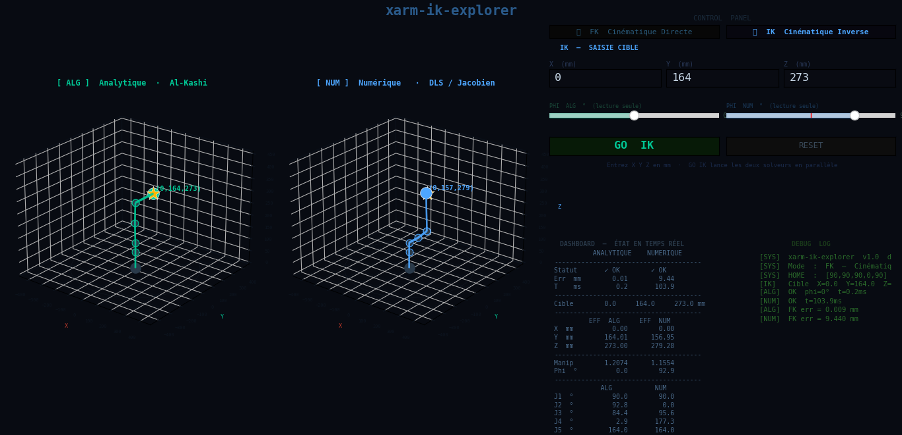

# xarm-ik-explorer

**Forward & Inverse Kinematics built from scratch on a 5-DOF X-Arm robot**

Two IK solvers — Analytical (Al-Kashi / geometric) and Numerical (Damped Least Squares / Jacobian) — derived independently from the DH parametrization, with an interactive 3D visualizer to compare them side by side.




---

## Context

This project does **not** use the manufacturer's IK library.

Starting from the X-Arm URDF file, I extracted the link lengths and joint parameters manually, built the full DH parameter table from analysis of the kinematic diagram, derived both FK and IK solvers from scratch, and implemented an interactive visualizer to compare the two approaches.

The goal was to understand the kinematics deeply — not just call an API.

Full technical derivation (with diagrams) is in [`docs/xarm_ik_explorer_report.pdf`](docs/xarm_ik_explorer_report.pdf).

---

## Robot — X-Arm 5-DOF

| Parameter | Value |
|-----------|-------|
| DOF | 5 |
| L1 (ground → joint 1) | 66.05 mm |
| L2 (joint 1 → joint 2) | 41.45 mm |
| L3 (joint 2 → joint 3) | 82.85 mm |
| L4 (joint 3 → joint 4) | 82.85 mm |
| L5 (joint 4 → joint 5) | 73.85 mm |
| L6 (joint 5 → gripper) | 90.00 mm |

Joint servo limits:

| Joint | Range |
|-------|-------|
| J1 Base | 0° – 180° |
| J2 Shoulder | 0° – 180° |
| J3 Elbow 1 | 0° – 180° |
| J4 Elbow 2 | 0° – 180° |
| J5 Gripper | 0° – 270° |

---

## DH Convention

Each joint is described by four DH parameters `(a, d, α, θ)`, read directly from the kinematic diagram. The OFFSET array converts servo angles to internal DH angles:

```
θ_DH = servo_rad - OFFSET_servo
OFFSET_servo = [π/2, π/2, π/2, 0, π/2]
```

`OFFSET_servo` was determined by physically observing the robot's HOME position: at HOME all internal DH angles equal zero by convention, so `OFFSET_servo` equals the recorded servo values.

The forward kinematics chain:

```
T06 = T01 · T12 · T23 · T34 · T45 · T56
```

L1 (ground → J1) is a pure Z translation with no rotation — T01 is a fixed offset matrix, not a joint.

---

## Forward Kinematics

`arm_ik_algebrique.py → fk(angles_servos_deg)`  
`ik_numerical.py      → fk(angles_servos_deg)`

Both modules implement the same FK from the DH matrices.  
Input: 5 servo angles in degrees.  
Output: end-effector position `[X, Y, Z]` in mm + full transformation matrix T06.

---

## Inverse Kinematics

### Analytical solver — `arm_ik_algebrique.py`

Geometric approach in the vertical plane defined by the target azimuth. The derivation works in two coordinate systems:

- **θ'ᵢ** — geometric angles, measured directly on the kinematic diagrams (horizontal/vertical reference)
- **θᵢ** — internal DH angles, used in the transformation matrices

A second offset, `OFFSET_geo`, converts between them — distinct from `OFFSET_servo` above:

```
OFFSET_geo = [0, -π/2, 0, +π/2, 0]
θᵢ = θ'ᵢ - OFFSET_geo[i]
```

`OFFSET_geo` was derived by comparing the geometric HOME configuration (last link perpendicular to the body, θ'₂ = 90°, θ'₄ = −90°) against the DH HOME convention (θ₂ = θ₃ = θ₄ = 0).

**Key steps:**
1. **J1** — direct azimuth, no geometric offset: `θ1_servo = arctan2(Y, X)`
2. **Wrist pivot position** — subtract end-effector vector (length L56, angle φ) from target to locate J4
3. **J3 (θ'₃)** — Al-Kashi (law of cosines) on triangle (J2, J3, J4); no geometric offset, so `θ3 = θ'3`
4. **J2 (θ'₂)** — geometric angle from horizontal, decomposed as `θ'2 = α + β`:
   ```
   A = L3 + L4·cos(θ'3)
   B = L4·sin(θ'3)
   α = arctan2(Z_m4, R_m4)
   β = arctan2(B, A)
   θ'2 = α + β
   θ2 = θ'2 - π/2          (geometric offset)
   ```
5. **J4** — geometric closure: `θ'4 = φ - θ'2 - θ'3`, then `θ4 = θ'4 + π/2`
6. **Servo conversion**: `servo_i = θᵢ + OFFSET_servo[i]`
7. FK validation: solution rejected if end-effector error > 1 mm

**Fallback strategy — `ik_auto()`:**
- φ expansion: ±5° steps up to ±180° when direct solution fails
- Mirror configuration for targets with Y < 0

**Mirror configuration — `ik_miroir()`:**

J1 servo range [0°, 180°] covers azimuth [0°, 180°] — the front half-space (Y ≥ 0).  
For targets with Y < 0 (behind the robot), the azimuth falls outside this range.

The mirror method solves this by orienting the arm toward the opposite vector `(-X, -Y)`:

1. Solve IK on the opposite target `(-X, -Y, Z)` — same reach distance R, same height Z
2. Orient J1 directly toward the real target: `θ1 = arctan2(-Y, -X)`
3. Apply symmetry on internal DH angles J2, J3, J4:
   ```
   θ2_mirror = -θ2          (symmetry about 0°, midpoint of J2 DH range)
   θ3_mirror = -θ3          (symmetry about 0°, midpoint of J3 DH range)
   θ4_mirror = 180° - θ4    (symmetry about 180°, midpoint of J4 DH range [0°,180°])
   θ5_mirror = θ5           (unchanged — gripper independent of arm pose)
   ```
4. FK validation on the real target

**Note on the θ2 formula:** Earlier derivations assumed θ2 (internal DH) was directly equal to `α + β`, which produced systematic errors up to 27 mm. The issue was the geometric offset: in this DH convention, θ2 = 0 corresponds to the arm pointing straight up, not horizontal. Once `θ2 = (α + β) - π/2` was applied, error dropped to < 0.05 mm.

---

### Numerical solver — `ik_numerical.py`

Damped Least Squares (DLS) with Jacobian, multi-restart strategy.

**Key parameters:**

| Parameter | Value |
|-----------|-------|
| Max iterations | 1000 |
| Step size α | 0.5 |
| λ_max (damping) | 0.05 |
| Singularity threshold ε | 0.01 |
| Convergence tolerance | 10 mm |
| Random restarts | 5 |

**Jacobian** (3×5, position only):
```
J[:,i] = z_i × (p_e - p_i)
```

**DLS update:**
```
Δθ = Jᵀ · (J·Jᵀ + λ²·I)⁻¹ · e
```
where λ² adapts to manipulability to avoid singularities.

---

## Visualizer — `visualizer_compare.py`

Interactive 3D comparison tool built with Matplotlib (screenshot above).

**FK mode** — manual joint control via sliders. Both arms follow simultaneously.

**IK mode** — enter a target (X, Y, Z) in mm, click GO IK. The two solvers run independently and animate to their respective solutions.

**Panel features:**
- 5 joint sliders (FK mode)
- XYZ target input (IK mode)
- PHI indicators (read-only, real wrist angle)
- Animated motion (25 frames)
- Dashboard: status, error, computation time, manipulability index, joint angles
- Debug log: live solver output (convergence, mirror activation, FK error)

---

## Project Structure

```
xarm-ik-explorer/
├── arm_ik_algebrique.py          # Analytical IK + FK + mirror method
├── ik_numerical.py               # Numerical IK (DLS) + FK + Jacobian
├── visualizer_compare.py         # Interactive 3D visualizer
├── docs/
│   ├── xarm_ik_explorer_report.pdf   # Full technical report (FK, analytical IK, numerical IK)
│   └── assets/
│       └── visualizer_screenshot.png
└── README.md
```

---

## Installation

```bash
git clone https://github.com/doriqu/xarm-ik-explorer.git
cd xarm-ik-explorer
pip install numpy matplotlib
python visualizer_compare.py
```

---

## Results

| Metric | Analytical | Numerical |
|--------|-----------|-----------|
| Avg. error (reachable targets) | < 0.05 mm | < 10 mm |
| Computation time | < 1 ms | 1 – 100 ms |
| Y < 0 targets | Supported (mirror method) | Supported |
| Near-singularity behavior | φ fallback | λ damping |
| Deterministic | Yes | No (random restarts) |

---

## Limitations

- Numerical IK: non-deterministic due to random restarts; convergence not guaranteed for all workspace positions
- φ (wrist pitch) is auto-selected by the analytical solver — not directly user-controlled in the current version
- Numerical solver does not target a specific φ — wrist pitch is a free variable determined by the optimizer

---

## Author

**Donald R. OKE**  
[GitHub](https://github.com/doriqu)

---

## License

MIT
